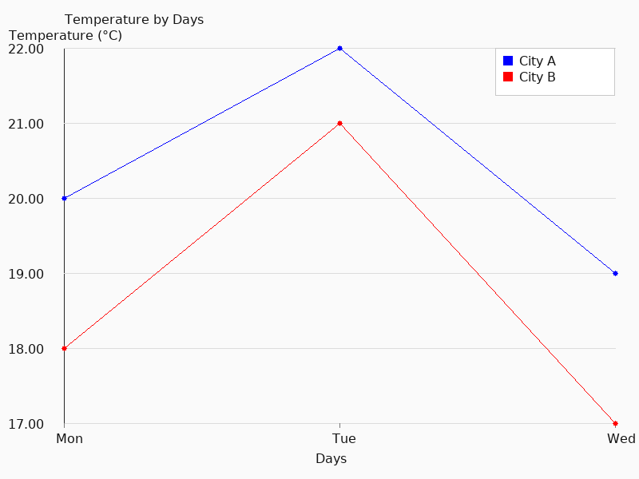

# 📊 GraphXML

**GraphXML** —  is a simple XML-based language for describing charts with rendering in **C + SDL2**.  
The idea is to create a lightweight and intuitive format, similar to Markdown, but for charts.  

---

## 🔤 Example GraphXML

<graph type="line" title="Temperature by Days">
    <x-axis label="Days"/>
    <y-axis label="Temperature (°C)"/>
    
    <dataset name="City A" color="blue">
        <point x="Mon" y="20"/>
        <point x="Tue" y="22"/>
        <point x="Wed" y="19"/>
    </dataset>

    <dataset name="City B" color="red">
        <point x="Mon" y="18"/>
        <point x="Tue" y="21"/>
        <point x="Wed" y="17"/>
    </dataset>
</graph>

## Demo

Here is an example of a graph created from **example.graphxml** and saved as PNG without opening a window (headless mode):

